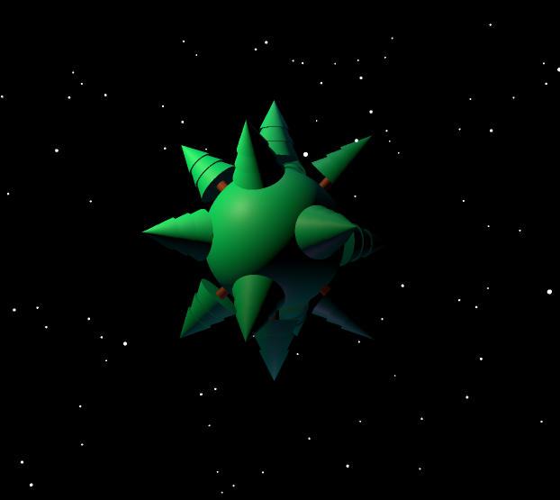

# Pine tree with three.js
A basic website using vite framework that uses three.js and gsap to display a planet with pine trees, surrounded by falling snowflakes and a rotating sun.

The user can move the camera around the planet.

# Screenshot
